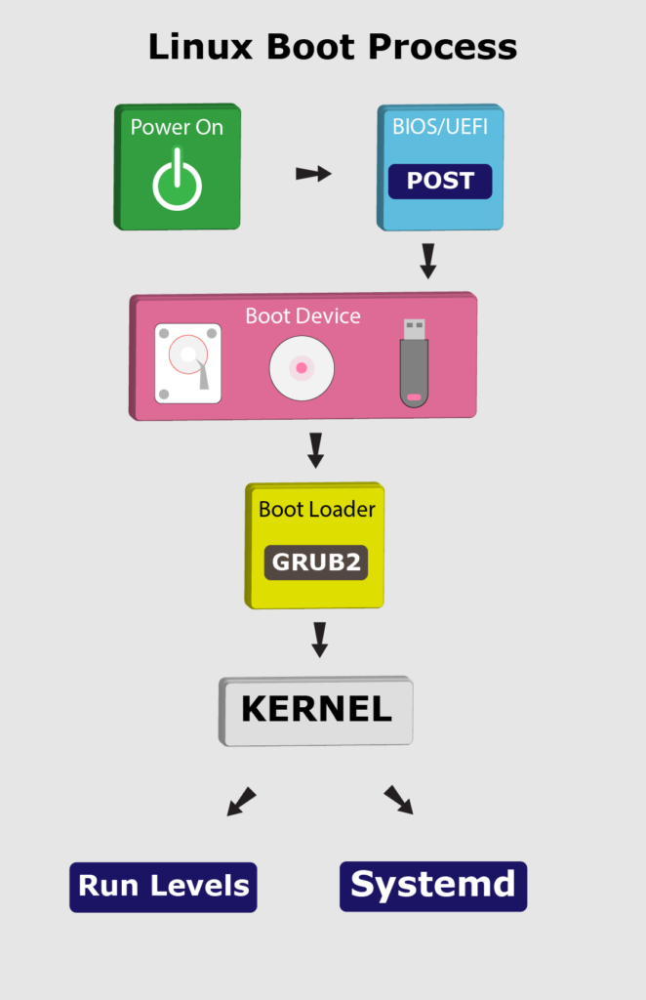

# The Boot Process of a Linux System

1. Introduction

The start-up of a Linux operating system follows a step-by-step process. This process starts with the power on or by running a command in the terminal:

   
In this tutorial, we’ll go through the booting steps of a Linux system.

2. BIOS and UEFI

First, the BIOS (Basic Input/Output System) or UEFI (Unified Extensible Firmware Interface) program kicks in once the system powers up. Usually, the BIOS contains all the code to gain initial access to the main machine devices:

* keyboard
* display screen
* disk drives
* serial communications

However, most of these devices will have dedicated device drivers taking over once the system boots fully.

BIOS and UEFI are firmware interfaces that computers use to boot up the operating system (OS). Yet, the two programs differ in how they store metadata on and about the drive:

* BIOS uses the Master Boot Record (MBR)
* UEFI uses the GUID Partition Table (GPT)

Next, the BIOS or UEFI runs the power-on self-test (POST). The POST does a series of tasks:

* verify the hardware components and peripherals
* carry out tests to ensure that the computer is in proper working condition

Further, if this test finds any error, it commonly shows an error message on the screen. In case the test fails to detect the RAM, POST triggers a beeping sound.

Finally, if the system passes the POST, it signals the start-up process to the next stage.


3. Boot Loader

Now, the BIOS or UEFI has run the POST to check the state of the machine. Moving on, the BIOS/UEFI selects a boot device depending on the system configuration. Usually, there’s a default boot order:

* Hard drives
* USB drives
* CD drives

Of course, we can configure the BIOS or UEFI to choose the boot device in any order. Whatever their order, the computer looks for the boot loader in these devices one by one.

In fact, a BIOS system has the boot loader located in the first sector of the boot device; this is the MBR. It takes up the first 512 bytes on the disk. On the other hand, a UEFI system stores all startup data in an .efi file. The file is on the EFI System Partition, which contains the boot loader.

For example, we can use fdisk to check the system partition on our machine:
```shell
$ fdisk -l
Disk /dev/nvme0n1: 232.91 GiB, 250059350016 bytes, 488397168 sectors
Disk model: Samsung SSD 960 EVO 250GB               
Units: sectors of 1 * 512 = 512 bytes
Sector size (logical/physical): 512 bytes / 512 bytes
I/O size (minimum/optimal): 512 bytes / 512 bytes
Disklabel type: gpt
Disk identifier: 6907D1B3-B3AB-7E43-AD20-0707A656A1B5

Device            Start       End   Sectors   Size Type
/dev/nvme0n1p1     2048   1050623   1048576   512M EFI System
/dev/nvme0n1p2  1050624  34605055  33554432    16G Linux swap
/dev/nvme0n1p3 34605056 488397134 453792079 216.4G Linux filesystem
```

Notably, the boot loader is a small program that loads the operating system. The main job of the boot loader is to perform three actions with the kernel: locate on the disk, insert into memory, and execute with the supplied options.

The following are some of the available boot loaders for a Linux system:

* LILO
* SYSILINUX
* GRUB2

In general, once the computer finds the boot loader on a device, it will run it. Consequently, this loads a larger and more complex program which eventually starts our operating system.


3.1. LILO

Initially, LILO (Linux Loader) was one of the most widely used Linux boot loaders. However, it has lost favor because it has no support for multi-boot environments and for UEFI. Also, it has limited support for new filesystems.

Officially, the developers of LILO halted its development and support in December 2015. Hence, the Linux Loader is old and mostly obsolete.

3.2. SYSLINUX

Equally, SYSLINUX is a boot loader for the Linux operating system, which runs on a FAT filesystem, typical for a Windows system. In short, its goal is to ease the process of installing Linux for the first time.

Further, SYSLINUX supports several major filesystems:

* FAT
* ext2
* ext3
* ext4

In addition, SYSLINUX can support Btrfs and XFS filesystems with some constraints.

3.3. GRUB2

Despite the many choices, almost all (non-embedded) modern Linux distributions use GRUB (GRand Unified Boot Loader) because it’s very feature-rich:

* ability to boot multiple operating systems
* boots both a graphical and a text-based interface
* allows ease of use over a serial cable
* strong command line interface for interactive configuration
* network-based diskless booting

Presently, [GRUB2](https://help.ubuntu.com/community/Grub2/Setup) has replaced its past version (GRUB), which is now known as [GRUB Legacy](https://www.gnu.org/software/grub/grub-legacy.html). Importantly, we can check for the GRUB version in our system using the following command:

```shell
$ sudo grub-install -V
grub-install (GRUB) 2.07-2ubuntu7
```

Now, let’s see what GRUB2 does in the boot process:

 1. takes over from BIOS or UEFI at boot time
 2. loads itself
 3. inserts the Linux kernel into memory
 4. turns over execution to the kernel

Notably, the GRUB configuration file is located at /boot/grub by default:

```shell
$ ls -l /boot/grub/
total 2380
-rw-r--r-- 2 root root 9006 SEP 30 22:14 /boot/grub/grub.cfg
...
```

Initially, GRUB Legacy had three stages in the boot process:

* Stage 1
* Stage 1.5
* Stage 2

However, with GRUB2, these stages don’t exist anymore. Instead, it contains various *.img files that serve similar functions.

At this point, GRUB2 inserts the kernel into memory and turns control of the system over to the kernel.


4. Kernel

After going through BIOS or UEFI, POST, and using a boot loader to initiate the kernel, the operating system now controls access to our computer resources.

Here, the Linux kernel follows a predefined procedure:

* decompress itself in place
* perform hardware checks
* gain access to vital peripheral hardware
* run the init process

Next, the init process continues the system startup by running init scripts for the parent process. Also, the init process inserts more kernel modules (like device drivers).

5. Systemd

To reiterate, the kernel initiates the init process, which starts the parent process. Here, the parent of all Linux processes is Systemd, which replaces the old SysVinit process. Following the booting steps, Systemd performs a range of tasks:

* probe all remaining hardware
* mount filesystems
* initiate and terminate services
* manage essential system processes like user login
* run a desktop environment

Indeed, these and other tasks allow users to interact with the system. Lastly, Systemd uses the /etc/systemd/system/default.target file to decide the state or target the Linux system boots into.


6. Run Levels

In Linux, the run level stands for the current state of the operating system. Run levels define which system services are running. Previously, SysVinit identified run levels by number. However, .target files now replace run levels in Systemd.

Further, Systemd activates the default.target unit by default when the system boots. Let’s check our default target:
```shell
# systemctl get-default
graphical.target
```

Now, let’s see the link between run level numbers and targets:

 * poweroff.target, run level 0: turn off (shut down) the computer
 * rescue.target, run level 1: initiate a rescue shell process
 * multi-user.target, run level 3: configure the system as a non-graphical (console) multi-user environment
 * graphical.target, run level 5: establish a graphical multi-user interface with network services
 * reboot.target, run level 6: restart the machine
 * emergency.target: emergency run level

For instance, the target value for a desktop workstation with a graphical user interface (GUI) is 5. This value stands for run level 5 which is graphical.target. Also, the run level for a server without a GUI is 3 because the default target is multi-user.target.

In addition, we can change the target (run level) while the system runs. This change entails that only services and other units defined under that target will now run on the system.

For example, to switch to run level 3 from run level 5, we can run the following command:
```shell
$ sudo systemctl isolate multi-user.target
```
Then, to take the system to run level 5, let’s run the command:
```shell
$ sudo systemctl isolate graphical.target
```

This command returns the run level to graphical.target, equivalent to level 5 for GUI.